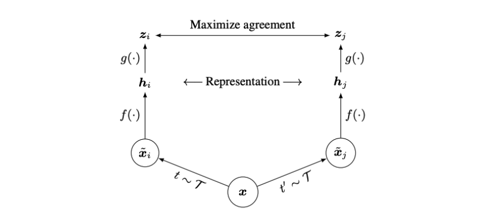
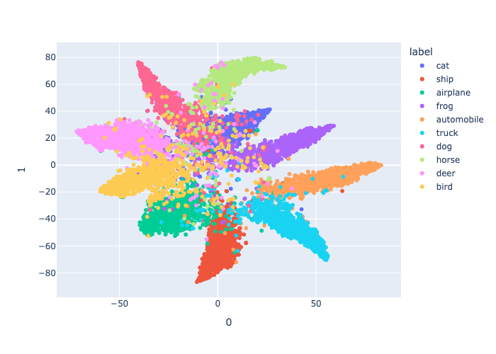
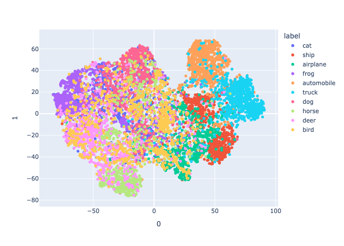
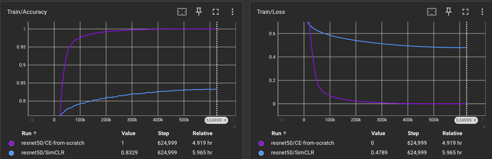
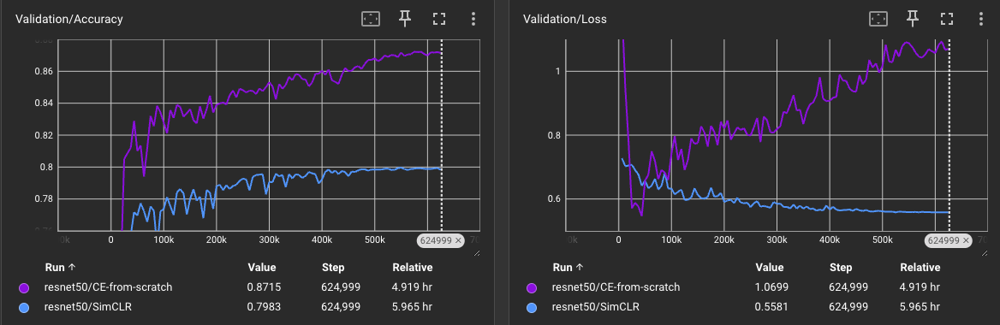

# SimCLR: A Lightning Implementation

<p align="center">
    
</p>

**Source**: [*A Simple Framework for Contrastive Learning of Visual Representations*](https://arxiv.org/abs/2002.05709).

## Overview
This repository implements SimCLR (A Simple Framework for Contrastive Learning of Visual Representations) using PyTorch Lightning. 

This pre-training method allows the model to learn visual representations **without the use of labels**.

It supports pre-training on **CIFAR-10** and **CIFAR-100**, followed by fine-tuning for classification tasks.

## Evaluation Strategy
To assess the quality of the pre-trained embeddings, the encoder is frozen and a classification head is fine-tuned on downstream tasks. 

Results are compared against a baseline model trained from scratch.

If the frozen pre-trained embeddings, with only a fine-tuned classification head, perform well on an unseen evaluation set, it indicates that **the pre-training objective successfully guided the model to learn robust and transferable embeddings.**

**Note**: For simplicity in validating my implementation, the CIFAR-10 test set was used during validation.

## CIFAR-10 Test Results (ResNet-50 Backbone)
| Implementation | Loss   | Accuracy   |
|----------------|--------|------------|
| SimCLR         | 0.558  | **79.83%** |
| From Scratch   | 1.070  | **87.15%** |

## Installation 
```bash
pip install -r requirements.txt
```

## Pre-train Configuration
Configure pre-training through `pre-train.yaml` found under the `config` directory. The configuration used in my experiments is shown below:


``` yaml
# Training
seed: 42
epochs: 200
version: 0
eta_min: 0.0
batch_size: 512
dataset: cifar10
weight_decay: 1.0e-6
lr_scaling_method: square-root

# Model
hidden_dim: 2048
temperature: 0.5
backbone: resnet50
projection_dim: 128
```

## Finetune Configuration
Alternatively, configure the finetuning script through `finetune.yaml` which is also found under the `config` directory. The configuration used in my experiments is shown below:

``` yaml
# Training
seed: 42
epochs: 100
eta_min: 1.0e-6
batch_size: 8
dataset: cifar10
weight_decay: 0.0
learning_rate: 1.0e-4
experiment_version: 1

# Model
num_classes: 10
backbone: resnet50
freeze_encoder: True
random_weight_init: False
```

## Training
To pre-train and finetune the model, run the following under the `src/` directory respectively.

```bash
# Contrastive pre-training
python train.py

# Finetuning
python finetune.py
```

## Embedding Visualization

**Trained from scratch using Cross Entropy**
<p align="center">
    
</p>

**Pre-trained with SimCLR**
<p align="center">
    
</p>


## Graphs

### Train 


### Validation

